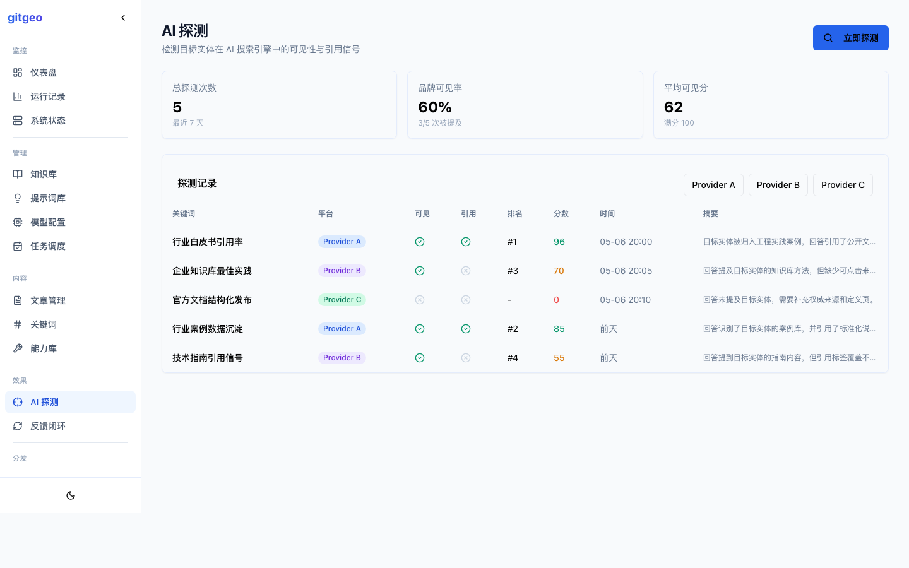
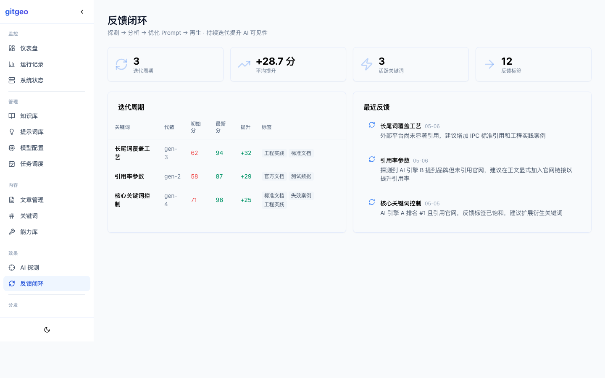
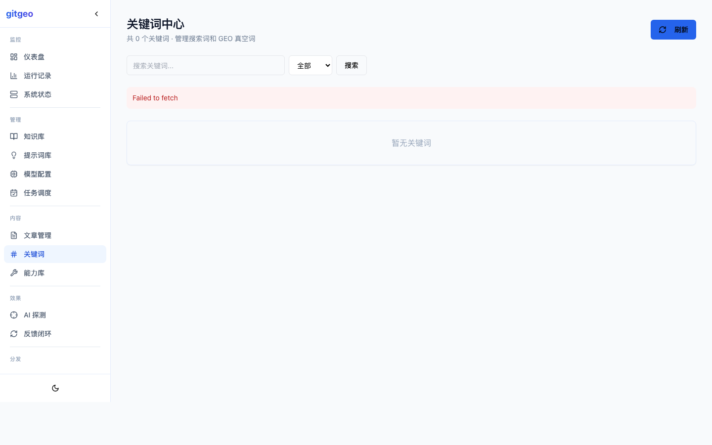
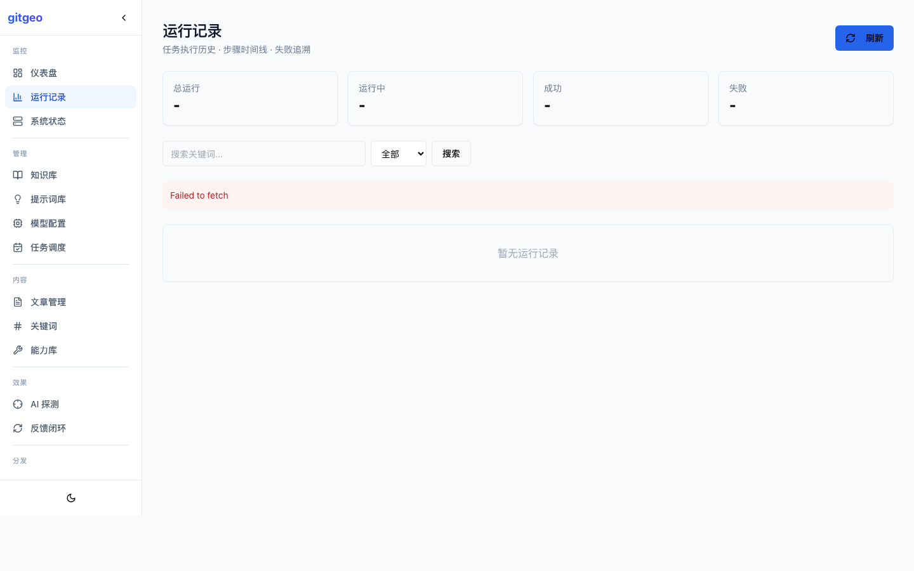
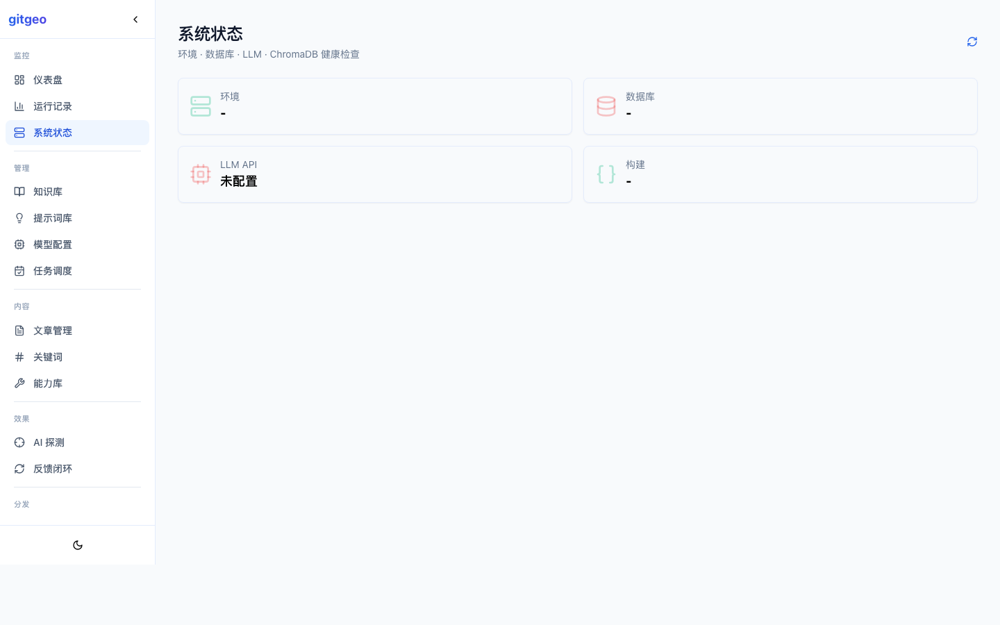
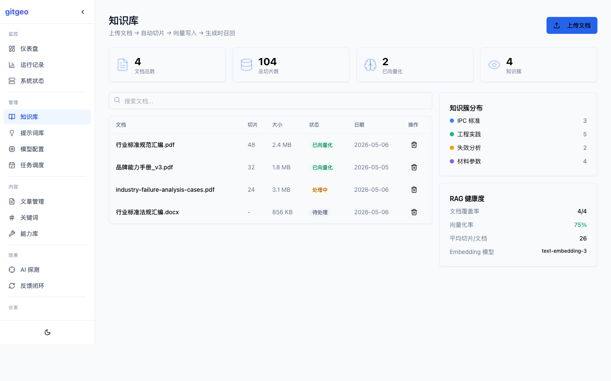

# gitgeo

> 🌍 **全球首个开源一站式 GEO（生成式引擎优化）系统** — 2026 年 4 月首次公开发布。

[](https://www.python.org/)
[](https://nextjs.org/)
[](https://fastapi.tiangolo.com/)
[](https://crewai.com/)
[](https://docs.docker.com/compose/)
[](LICENSE)

> 🇬🇧 [English](README_EN.md) | 🇨🇳 简体中文

---

## 它是什么

gitgeo 是一套**完整的 GEO 工作流引擎**——从关键词发现、AI 内容生产、9 维质量评分、AI 平台可见性探测、Prompt 反馈闭环到多渠道分发，全部工程化串联。

大多数内容系统止步于「关键词 → 生成 → 发布」。gitgeo 把更关键的一环做进了闭环：**测量你的内容是否真的被 AI 搜索引擎引用，然后让监测数据驱动下一轮 Prompt 优化。**

---

## 功能

### AI 可见性探测

主动探测国产 AI 搜索引擎（DeepSeek、Kimi、豆包），检测品牌在 AI 回答中的可见性、引用情况和排名位置。探测结果结构化入库，支持按关键词、按平台、按时间维度的趋势分析。

### Prompt 反馈闭环

```
生成 → 探测 → 分析引用标签 → 写回反馈 → 注入下一轮 Prompt → 再生
```

每次探测后自动提取工程实践、官方文档、标准文档、测试数据、失效案例等引用标签，未命中的标签会转化为下一轮 Prompt 的优化指引。这是 gitgeo 区别于所有纯内容生成系统的核心能力。

### 9 维质检 + 自动返修

每篇文章自动评分：字数深度、H2 结构、数据表格、FAQ 章节、参考文献、首句定义、违禁词检查、逻辑推理链、标题质量。低于 80 分自动生成返修指令，最多 3 次迭代。

### 能力记忆层

品牌可验证能力参数的结构化存储与引用溯源。Agent 生成文章时自动查询能力库，确保数据口径一致。

### 知识库 RAG

上传文档 → 自动切片 → 向量写入 → 生成时按需召回相关片段。

### 多平台分发

内置知乎、微信公众号发布适配器。可扩展的适配器模式支持接入更多平台。

### Next.js 管理后台

14 页管理系统，亮色/暗色双主题。Demo Mode 无需 API Key 即可浏览全部页面。






### 技术栈

| 层 | 技术 |
|---|------|
| AI 编排 | CrewAI 多 Agent 流水线 |
| LLM | OpenAI 兼容 API（OpenAI / DeepSeek / Groq / vLLM） |
| 后端 | FastAPI (Python 3.12+) |
| 前端 | Next.js 14 + React 18 + Tailwind CSS + shadcn/ui |
| 数据库 | MySQL 8.0 |
| 向量存储 | ChromaDB |
| 部署 | Docker Compose + GHCR 镜像 |

---

## 5 分钟快速开始

```bash
git clone https://github.com/xxxbozzz/gitgeo.git && cd gitgeo
cp .env.example .env
# 编辑 .env: 填入 GEO_LLM_API_KEY

docker compose up -d
```

首次启动自动建表 + 导入种子关键词。

无需 API Key 也能浏览管理后台 Demo Mode：

```bash
cd frontend_next && npm install && npm run dev
open http://localhost:3000/admin/dashboard
```

## 配置

```bash
# LLM 提供商（OpenAI 兼容 API）
GEO_LLM_API_KEY=your-api-key
GEO_LLM_BASE_URL=https://your-openai-compatible-endpoint/v1
GEO_LLM_MODEL=your-model-name

# 品牌配置（可选）
TARGET_ENTITY_NAME=我的品牌
GEO_ORG_NAME=我的品牌
GEO_SITE_DOMAIN=example.com
```

## 管理后台预览










## 文档

- [系统架构](docs/system_structure.md)
- [AI 反馈闭环](docs/ai_feedback_loop.md)
- [Prompt 流水线](docs/prompt_pipeline_guide.md)
- [最小 Demo](docs/minimal_demo.md)

## 致谢

本项目在早期得到了[**四川深亚电子科技有限公司**](https://www.pcbshenya.com)的业务场景验证支持。深亚电子是高端 PCB 制造服务商，为项目提供了真实的 GEO 推广需求、行业知识反馈和生产环境验证。

## 许可

MIT © [xxxbozzz](https://github.com/xxxbozzz)
