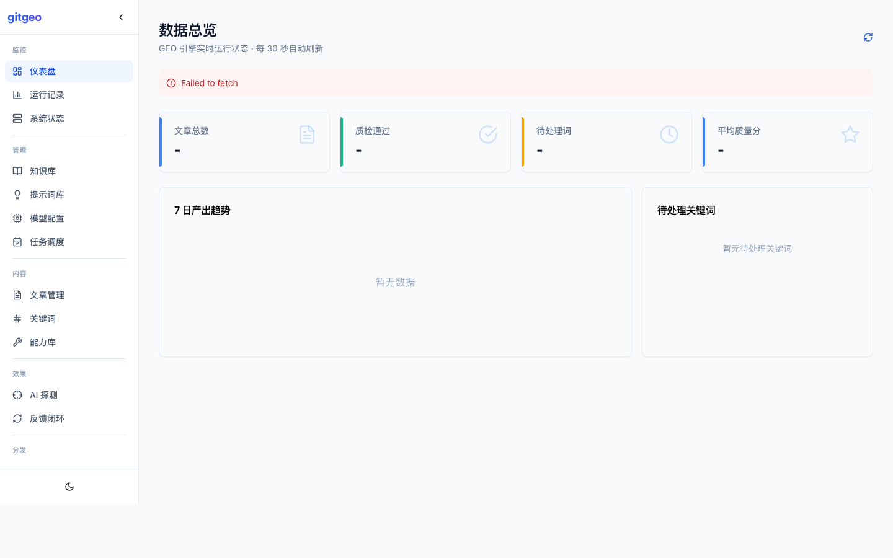
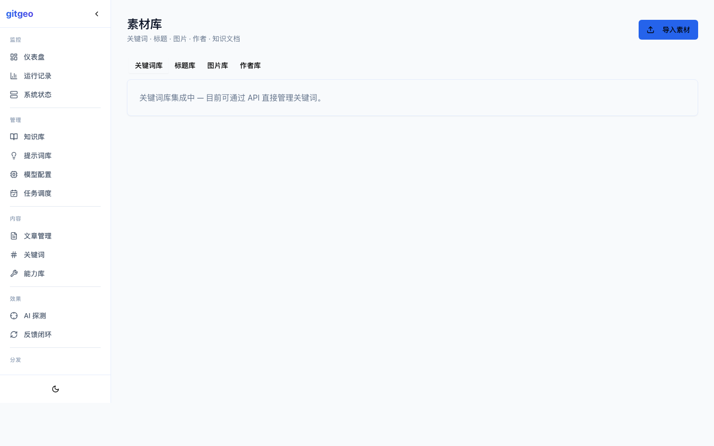
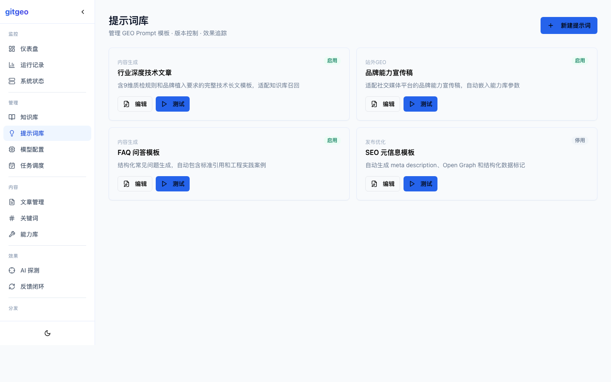
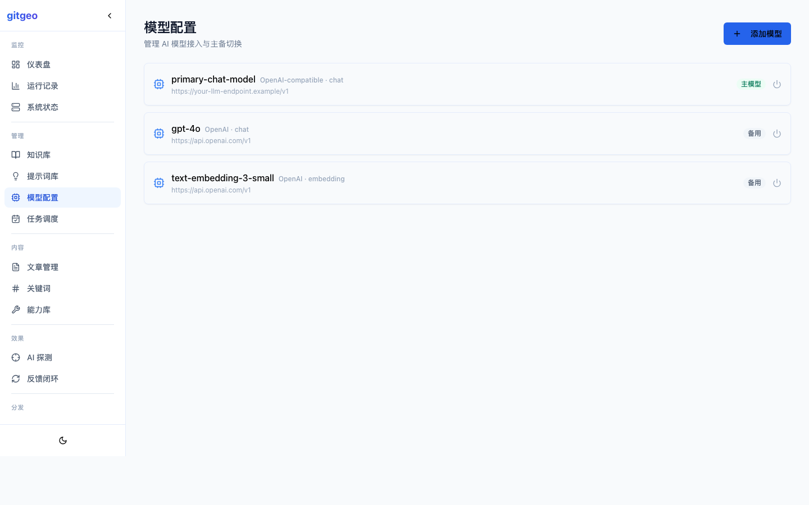
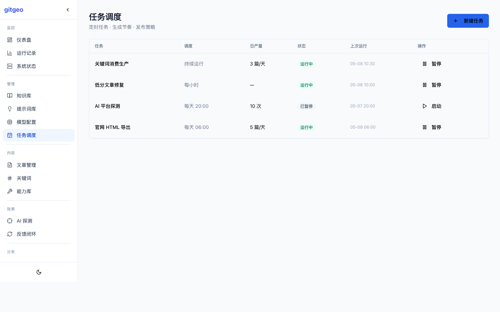
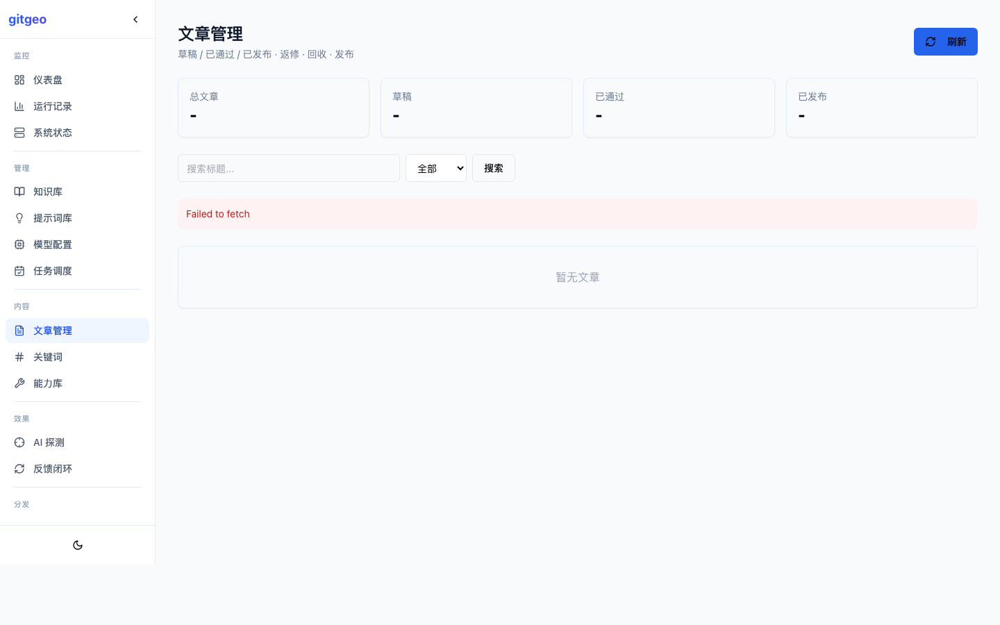
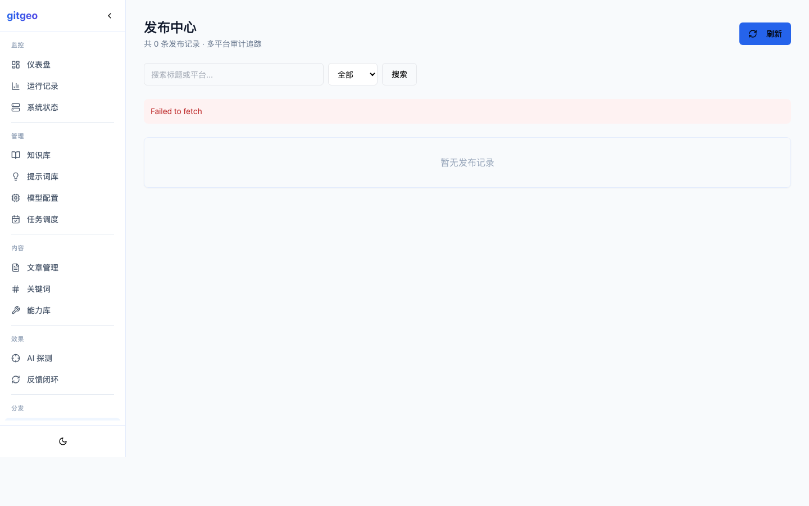
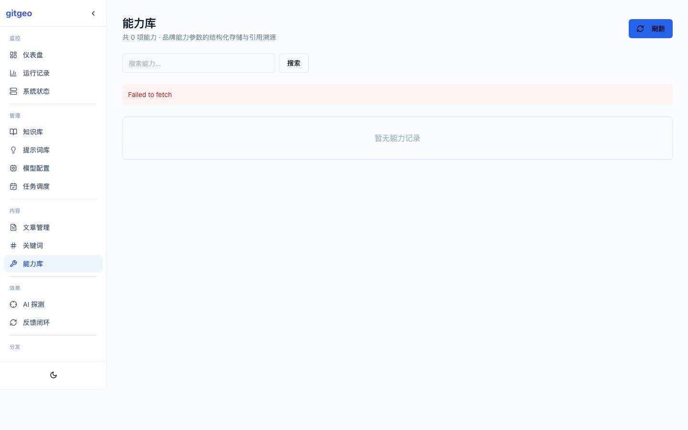

# gitgeo

> 🌍 **全球首个开源一站式 GEO（生成式引擎优化）系统** — 2026 年 4 月首次公开发布。
> The world's first open-source one-stop GEO engine. Public since April 2026.

[](https://www.python.org/)
[](https://docs.docker.com/compose/)
[](LICENSE)
[](https://github.com/xxxbozzz/gitgeo/stargazers)
[](https://github.com/xxxbozzz/gitgeo/network)

> 🇬🇧 [English](README_EN.md)

---

## 它是什么

gitgeo 是一套**完整的 GEO 工作流引擎**，覆盖从关键词发现、AI 内容生产、9 维质量评分、AI 平台可见性探测、Prompt 反馈闭环到多渠道分发的全链路。

大多数内容系统只做「找关键词 → 生成文章 → 发布」。gitgeo 多做了关键的一半：**测量你的内容是否真的被 AI 搜索引擎引用，然后把结果反哺到下一轮生产**。

### 竞品对比

| 能力 | 其他 GEO 工具 | gitgeo |
|------|:---:|:---:|
| AI 内容生成 | ✅ | ✅ CrewAI 多 Agent 协作 |
| 知识库 RAG | ✅ | ✅ ChromaDB 向量检索 |
| 素材/标题/提示词管理 | ✅ | ✅ 管理后台 UI |
| 文章质量评分 | ❌ | ✅ 9 维自动评分 + 自动返修 |
| AI 平台可见性探测 | ❌ | ✅ DeepSeek/Kimi/豆包/元宝 |
| Prompt 反馈闭环 | ❌ | ✅ 探测→分析→优化→再生 |
| 能力记忆层 | ❌ | ✅ 结构化品牌参数库 |
| 多平台外部发布 | ❌ | ✅ 知乎/微信 + 可扩展适配器 |
| Docker 一键部署 | ⚠️ | ✅ `docker compose up` |
| Vue 管理后台 | ⚠️ | ✅ 12 页管理系统 |

---

## 5 分钟快速开始

```bash
# 1. 克隆并配置
git clone https://github.com/xxxbozzz/gitgeo.git && cd gitgeo
cp .env.example .env
# 编辑 .env：填入 GEO_LLM_API_KEY（其余有合理默认值）

# 2. 一键启动
docker compose up -d

# 3. 验证
curl http://localhost:8001/api/v1/ready      # → {"status":"ok"}
curl http://localhost:8001/api/v1/overview/kpis  # → 关键词已就绪
open http://localhost:8503                    # 旧版 Streamlit 面板
open http://localhost:5173                    # Vue 管理后台（开发模式）
```

**首次启动自动完成：** 创建数据库表 → 导入种子关键词 → 启动生产引擎。30 秒内开始生成第一篇文章。

---

## 系统架构

```
┌──────────────────────────────────────────────────┐
│              Vue 3 管理后台 (12 页)                │
│  仪表盘 │ 素材库 │ 提示词 │ 模型 │ 任务 │ 发布     │
├──────────────────────────────────────────────────┤
│           FastAPI 后端 (/api/v1)                  │
│  文章 │ 关键词 │ 能力库 │ 发布 │ 运行 │ 系统       │
├──────────────────────────────────────────────────┤
│                   核心引擎                          │
│  ┌──────────┐ ┌──────────┐ ┌──────────────────┐  │
│  │ 生产引擎  │ │ 质检引擎  │ │ 反馈引擎          │  │
│  │ CrewAI   │ │ 9 维评分  │ │ Prompt 优化器     │  │
│  │ 多 Agent │ │ 自动返修  │ │ AI 平台探测       │  │
│  └──────────┘ └──────────┘ └──────────────────┘  │
├──────────────────────────────────────────────────┤
│          MySQL │ ChromaDB │ Docker                │
└──────────────────────────────────────────────────┘
```

### 反馈闭环（核心创新）

```
生成文章(含标准/文档/测试数据等证据) → 9 维质检 → 
AI 平台探测(DeepSeek提到我们品牌了吗?) → 写回反馈数据 → 
注入下一轮 Prompt → 每轮产出更易被引用的内容
```

---

## 截图预览

> 以下为 Vue 管理后台实际运行截图。

### 仪表盘


### 素材库（关键词/标题/图片/作者/知识库）


### 提示词库


### 模型配置


### 任务调度


### 文章管理


### 发布中心


### 能力库


*（截图路径：`docs/images/screenshots/`，请补充实际截图）*

---

## 配置指南

### 最小配置

只需在 `.env` 中设置 3 个变量：

```bash
GEO_LLM_API_KEY=sk-your-key-here        # LLM API 密钥
GEO_LLM_BASE_URL=https://api.deepseek.com  # API 端点
GEO_LLM_MODEL=deepseek-chat             # 模型名称
```

支持任意 OpenAI 兼容 API：DeepSeek、OpenAI、Groq、本地 vLLM 等。

### 品牌定制（可选）

```bash
TARGET_ENTITY_NAME=我的品牌
TARGET_ENTITY_ALIASES=品牌别名1,品牌别名2
GEO_ORG_NAME=我的公司
GEO_SITE_DOMAIN=example.com
```

### 关键词配置

编辑 `seed_topics.json`：

```json
[
  {"keyword": "你的第一个关键词", "search_volume": 1000, "difficulty": 30},
  {"keyword": "第二个关键词", "search_volume": 800, "difficulty": 45}
]
```

或通过 API 动态添加：
```bash
curl -X POST http://localhost:8001/api/v1/keywords \
  -H "Content-Type: application/json" \
  -d '{"keyword": "新关键词"}'
```

### 启用 AI 探测（可选）

```bash
GEO_ENABLE_PROBING=true
GEO_PROBE_PLATFORMS=deepseek,kimi,doubao
```

开启后，系统定期探测 AI 平台对目标关键词的品牌提及情况，结果反哺到 Prompt 优化。

---

## 管理后台

启动后可访问：

| 页面 | 路径 | 功能 |
|------|------|------|
| 仪表盘 | `/dashboard` | KPI 总览、趋势图、看板 |
| 素材库 | `/materials` | 关键词/标题/图片/作者/知识库管理 |
| 提示词库 | `/prompts` | Prompt 模板管理、版本控制 |
| 模型配置 | `/models` | AI 模型接入、主备切换 |
| 任务调度 | `/tasks` | 定时任务创建、日产量控制 |
| 文章管理 | `/articles` | 文章 CRUD、预览、返修、发布 |
| 关键词中心 | `/keywords` | 关键词池、GEO 真空词 |
| 能力库 | `/capabilities` | 品牌能力参数管理 |
| 发布中心 | `/publications` | 多平台发布审计 |
| 运行记录 | `/runs` | 任务执行历史、步骤时间线 |
| 知识图谱 | `/graph` | 内链关系可视化 |
| 系统状态 | `/system` | 环境、DB、LLM 健康检查 |

---

## 文档

- [系统架构](docs/system_structure.md) — 完整架构与数据流
- [AI 反馈闭环](docs/ai_feedback_loop.md) — 探测结果如何优化 Prompt
- [Prompt 流水线](docs/prompt_pipeline_guide.md) — 设计高效的 GEO Prompt
- [创作者指南](docs/prompt_creator_guide.md) — 编写可维护的 Prompt 资产
- [最小 Demo](docs/minimal_demo.md) — 本地开发环境搭建
- [部署运维](docs/ops_deploy_runbook.md) — 生产部署指南

---

## 路线图

- [x] Docker 一键部署
- [x] AI 平台主动探测
- [x] Prompt 反馈闭环
- [x] 9 维质检 + 自动返修
- [x] 管理后台 UI
- [ ] CloakBrowser 反检测发布
- [ ] 多站点管理
- [ ] 后台多语言（中/英/日）
- [ ] Celery 任务队列

---

## 贡献

gitgeo 是 MIT 协议开源项目。欢迎贡献代码、文档、Prompt 模板或行业适配。详见 [CONTRIBUTING.md](CONTRIBUTING.md)。

核心原则：
- 不在共享模块中硬编码特定品牌
- 发布接口统一使用 `channel`/`adapter` 命名
- 文档面向 GEO 初学者可理解

---

## 致谢

本项目在早期得到了**四川深亚电子科技有限公司**的业务场景验证支持。感谢深亚电子提供了真实的 GEO 推广需求、行业知识反馈和生产环境验证机会。

---

## 许可

MIT © [xxxbozzz](https://github.com/xxxbozzz)
